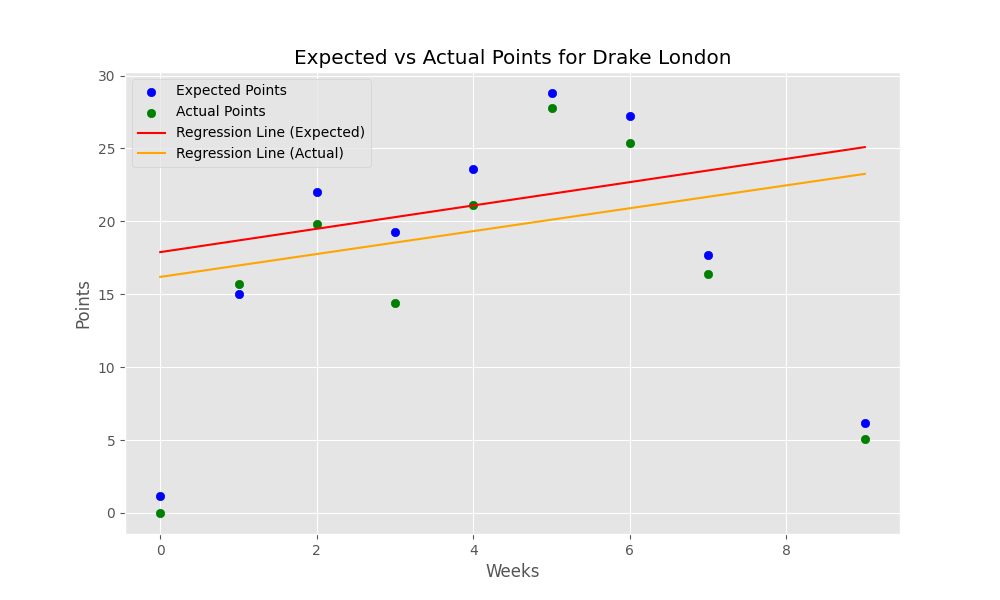
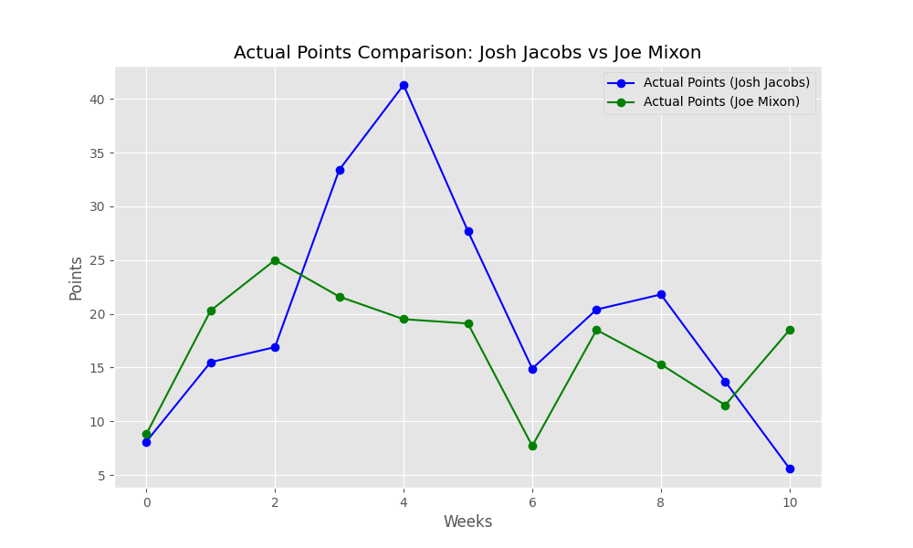
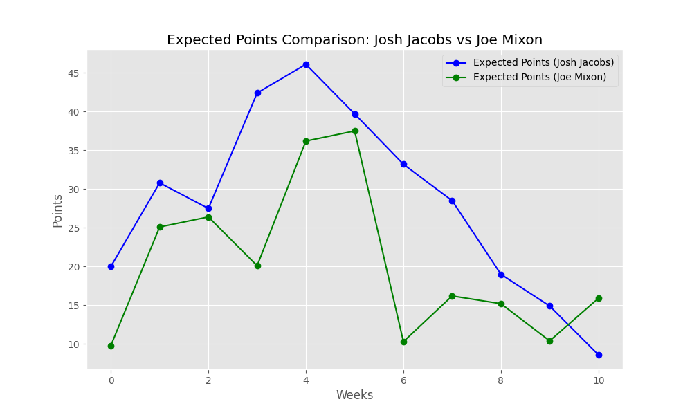
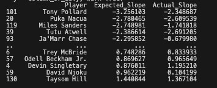

# Fantasy Sports Analytics Toolkit

This toolkit is designed for in-depth analysis and visualization of player performances in fantasy sports. It includes a set of Python functions that work with player performance data, enabling users to predict future trends, compare players, and visualize data effectively. Below are detailed descriptions and usage examples for each function:


## 1. `calculate_expected_points_change(dataframes, position_filter=None, min_expected_points_average=5, rate_of_change_weeks=2)`
### Description:
This function calculates the expected change in a player's points over a specified number of weeks. It can work with multiple dataframes, allowing for a comprehensive and comparative analysis across different time frames.

- **Inputs**: 
  - `dataframes`: A list of Pandas dataframes, each containing player performance data for different weeks.
  - `position_filter`: Optional. Filters players based on their position.
  - `min_expected_points_average`: The minimum average of expected points for including a player in the analysis.
  - `rate_of_change_weeks`: The number of weeks over which the rate of change is calculated.

### Example Usage:
```python
# Assuming 'dataframes' is a list of Pandas dataframes loaded with player data
expected_points_change = calculate_expected_points_change(dataframes)
print(expected_points_change)
```
--- 

## 2. `plot_player_regression(merged_df, player_name, point_type='expected', recent_weeks=5)`
### Description:
Generates a plot showing a player's performance trend over a specified number of weeks. It can display either actual or expected fantasy points.

- **Inputs**:
  - `merged_df`: A Pandas dataframe containing merged player data from multiple weeks.
  - `player_name`: The name of the player to plot.
  - `point_type`: Type of points to plot ('expected' or 'actual').
  - `recent_weeks`: The number of recent weeks to include in the plot.

### Example Usage:
```python
plot_player_regression(merged_df, 'Drake London', recent_weeks=11) 
```

 

---

## 3. `plot_player_comparison(merged_df, player1_name, player2_name, point_type='expected', recent_weeks=5)`
### Description:
This function compares the performance of two players side-by-side. It's useful for directly contrasting their performances in terms of either expected or actual fantasy points over a chosen time frame.

- **Inputs**:
  - `merged_df`: A Pandas dataframe containing merged player data from multiple weeks.
  - `player1_name` & `player2_name`: Names of the two players to compare.
  - `point_type`: Type of points to compare ('expected' or 'actual').
  - `recent_weeks`: The number of recent weeks to include in the comparison.

### Example Usage:
```python
plot_player_comparison(merged_df, 'Josh Jacobs', 'Joe Mixon', point_type='expected', recent_weeks=11)
```



---

## 4. `calculate_slope(dataframes)`
### Description:
The `calculate_slope` function is designed to calculate the slope of the performance trend for each player across multiple dataframes. This function provides a straightforward way to understand the performance trajectory of players, whether they are improving, declining, or remaining consistent over time.

- **Input**: `dataframes`, a list of Pandas dataframes each containing player performance data for different weeks.
- **Output**: A dictionary where each key is a player's name and the value is the slope of their performance trend.

### Example Usage:
```python
players_slope = calculate_slope(dataframes)
```

